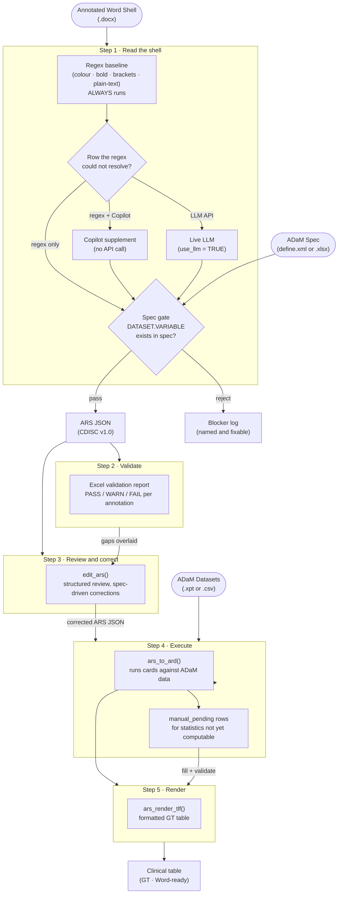

<!-- README.md is generated from README.Rmd. Please edit that file -->

# arsbridge

<!-- badges: start -->

[](https://lifecycle.r-lib.org/articles/stages.html#experimental)
[](https://github.com/tavakohr/arsbridge/actions/workflows/R-CMD-check.yaml)
[](https://app.codecov.io/gh/tavakohr/arsbridge)
[](https://opensource.org/licenses/MIT)
<!-- badges: end -->

> **From annotated Word shell to publication-ready clinical table, in one reproducible pipeline.**

Clinical programmers spend hours translating a lead programmer's annotated TLF shell into R code, then reformatting output to match the shell layout. `{arsbridge}` automates both halves. It reads the annotations directly from the Word document, checks every variable against your ADaM spec, generates a CDISC Analysis Results Standard (ARS) JSON, executes it against real ADaM datasets with `{cards}`, and renders a formatted GT table ready to ship.

No manual transcription. No orphan numbers. Every value auditable back to its source.

------------------------------------------------------------------------

## What you get

| Capability | What it means for you |
|---|---|
| **Three ways to read the shell** | A deterministic regex baseline always runs; you choose how the gaps it cannot resolve get filled — **regex only** (no key), a **Copilot supplement** (no API call), or a **live LLM** (opt-in with a key). Same spec-gated output from all three. |
| **Spec-gated validation** | Every variable proposed — by the regex, a supplement, or the LLM — is checked against your ADaM spec. A variable missing from the spec is rejected and logged, never silently invented. |
| **CDISC ARS JSON output** | The extraction result is a structured, versioned file you can diff, review, and feed to downstream tools like `{siera}`. |
| **Native ARD execution** | Run ARS JSON directly against `.xpt` or `.csv` datasets using `{cards}`, with no dataset-loading boilerplate. |
| **Codelist-decoded categories** | A coded categorical variable (e.g. a numeric `DCSREASN`) is decoded through the ADaM spec’s codelist: the ARD and rendered table show `DEATH`, not `1`, in codelist order, with unobserved terms reported as n = 0. Unannotated coded column axes get their column labels from the codelist too. |
| **Publication-ready tables** | `ars_render_tlf()` builds a formatted GT table: treatment columns detected, percentages rescaled, row groups labelled, ARS footnotes carried through. |
| **Partial tables, full traceability** | Statistics arsbridge cannot yet compute are reserved as keyed `manual_pending` rows. Each shows a `[‡ manual]` marker in the table until a programmer fills it with a validated script. Nothing is ever an orphan number. |

------------------------------------------------------------------------

## The pipeline at a glance



------------------------------------------------------------------------

## Review and correct before executing

The semantic enrichment is automated, so the generated ARS JSON is a
draft: a method can be misclassified, a population can be wrong, an
annotated line can be missed entirely. `edit_ars()` is the
human-in-the-loop stage between generating and executing.

``` r
res <- spec_to_ars(
  shell_path     = "inputs/annotated_shells.docx",
  adam_spec_path = "inputs/adam_spec.xlsx"
)

# Review and correct: the result carries the event, the validation
# report and the spec, so nothing else needs passing.
corrected <- edit_ars(res)

# Execute what you corrected.
ard <- ars_to_ard(corrected, adam_dir = "adam")
```

You see the shell's structure rather than JSON – each output with its
analysis lines beneath it – with validation findings badged onto the
lines they concern. Selecting a line resolves its ids into what they
mean: the method's name plus whether the engine can actually execute it,
the population's condition, the variables the results are split by.
Variables come from the ADaM spec, so they cannot be mistyped, and every
dropdown says how many analyses share the entity, because editing a
shared method edits all of them.

Nothing is written until you save, and saving shows what changed first.
The previous file is backed up, the write is atomic, and the edit log
goes to a sidecar `.edits.json` so the ARS JSON itself stays CDISC-clean
-- `export_edit_log()` turns that sidecar into a QC workbook.

Every change is undoable, and a session that dies is offered back the
next time you open the same file, so a review cannot be lost to a
mis-click or a crashed browser. `ars_conformance()` checks any reporting event
against the official CDISC ARS v1.0 schema (vendored and pinned in the
package), and a freshly generated event validates clean.

Use `view_ars()` for the same view without the ability to change
anything, and `validate_ars_model()` for the findings on the command
line. The viewer needs `shiny`, `bslib` and `DT`, which are optional:

``` r
install.packages(c("shiny", "bslib", "DT"))
```

------------------------------------------------------------------------

## Installation

You can install `{arsbridge}` from GitHub:

``` r
# install.packages("devtools")
devtools::install_github("tavakohr/arsbridge")
```

For exact Clopper-Pearson confidence intervals, also install the
optional `{cardx}`. Without it, those cells degrade gracefully to
`manual_pending` placeholders rather than erroring.

``` r
install.packages("cardx")
```

> **No LLM API key?** You do not need one. `arsbridge` runs on regex +
> heuristics alone, and `ars_copilot_instructions()` sets up a no-API workflow
> that reaches near-LLM accuracy through a chat assistant. See
> [No API key? Three tiers, always runs](#no-api-key-three-tiers-always-runs).

------------------------------------------------------------------------

## Quick start with the bundled example

You do not need any external files to run the full pipeline. The package
ships with a complete clinical study example (40 TLF shells, simulated
ADaM data) so you can see the whole thing before touching your own
study.

``` r
library(arsbridge)

# 1. Run the full extraction pipeline on the bundled study
res <- spec_to_ars_example()
#    Takes about 6 minutes (40 LLM calls)
#    res$n_tlfs      # 40
#    res$n_analyses  # ~226

# 2. Review the validation findings
table(res$validation$status)

# 3. Load the bundled simulated ADaM data
adam_dir <- file.path(tempdir(), "ADaM")
unzip(arsbridge_example("ADaM.zip"), exdir = adam_dir)

# 4. Execute the ARS JSON into a tidy ARD
ard <- ars_to_ard(ars_path = res$ars_path, adam_dir = adam_dir)

# 5. Render the Subject Disposition table
ars_render_tlf(res$ars_path, ard, "T_14_1_1")
```

------------------------------------------------------------------------

## Step-by-step with your own study

### Step 1: Set up LLM access

`{arsbridge}` works with Anthropic, OpenAI, Gemini, or any
OpenAI-compatible provider. Store keys in `~/.Renviron` so they persist
across sessions.

``` r
library(arsbridge)

set_anthropic_key()   # recommended for clinical text (lowest content-filter false-positive rate)
set_openai_key()      # alternative
set_gemini_key()      # alternative

show_active_llm()     # confirm which provider is active
```

**Provider priority:** when multiple keys are configured, `{arsbridge}`
searches in order: Anthropic, OpenAI, Gemini. Override this anytime:

``` env
# In .Renviron
ARS_LLM_PROVIDER=openai
```

``` r
# Or at runtime
options(ars.llm.provider = "gemini")
```

**Switching to a newer model or a different provider** requires almost
no effort. To use a newer model from the same provider, pass `model =`:

``` r
spec_to_ars(..., model = "claude-opus-4-8")
```

To add a brand-new provider (GLM, DeepSeek, OpenRouter), add one entry
to the registry in `R/llm_providers.R`: its key env variable, default
model, the `ellmer` chat constructor, and a `base_url` if it is
OpenAI-compatible. No other code changes.

``` r
set_llm_key("glm", "your-glm-key")
Sys.setenv(ARS_LLM_PROVIDER = "glm")
spec_to_ars(..., model = "glm-4.6")
```

------------------------------------------------------------------------

### Step 2: Extract ARS JSON from the annotated shell

`spec_to_ars()` is the main entry point. Point it at your annotated
Word shell and ADaM spec; it writes a CDISC ARS JSON and an Excel
validation report.

``` r
res <- spec_to_ars(
  shell_path     = "inputs/APX-DRM-301_TLF_Shells_v1.0_sample_annotated.docx",
  adam_spec_path = "inputs/adam_spec_APX-DRM-301.xlsx",   # or define.xml
  output_path    = "outputs/reporting_event.json",
  report_path    = "outputs/spec_validation_report.xlsx",
  study_id       = "APX-DRM-301",
  study_name     = "PROSVALIN Phase 3 Study",
  verbose        = TRUE
)
```

| Argument | What to pass |
|---|---|
| `shell_path` | The annotated `.docx` file from the lead programmer |
| `adam_spec_path` | `define.xml` (preferred) or an ADaM spec `.xlsx` / `.xls` |
| `output_path` | Where to save the CDISC ARS JSON |
| `report_path` | Where to save the Excel validation workbook |

------------------------------------------------------------------------

### Step 3: Review the validation report

The Excel report cross-references every shell annotation against the
ADaM spec and stamps each one **PASS**, **WARN**, or **FAIL**. This is
your opportunity to catch typos and missing ADaM variables before any
analysis code runs.

Each row is tinted by its status, and the workbook’s **Legend** sheet
spells this out. The colors (and their exact fill hex codes) are:

| Status | Fill | Hex | Meaning |
|---|---|---|---|
| **PASS** | green | `E2EFDA` | Annotation matched a dataset + variable in the ADaM spec. No action needed. |
| **WARN** | amber | `FFF2CC` | Needs review (e.g. an uncertain mapping). The ARS JSON is still generated. |
| **FAIL** | red | `FCE4D6` | Could not be validated (invalid dataset/variable, or a blocking gap). Fix before use. |
| **INFO** | blue | `DDEBF7` | Informational note (mainly the Diagnostics sheet). Not a validation failure. |

WARN and FAIL are review signals, not automatic blockers — the JSON is
written even when they are present, so a qualified programmer can triage
them. A cell with no tint simply carries no status.

``` r
# Counts by status
table(res$validation$status)

# Filter to problems only
subset(res$validation, status %in% c("WARN", "FAIL"))
```

------------------------------------------------------------------------

### Step 4: Execute to a tidy ARD

`ars_to_ard()` runs the ARS JSON against your ADaM datasets and returns
a tidy ARD in `{cards}` format. It auto-loads datasets, applies
population and data subset filters recursively, and calls the right
`{cards}` function for each method.

``` r
ard <- ars_to_ard(
  ars_path = "outputs/reporting_event.json",
  adam_dir = "inputs/ADaM"
)

print(ard)
```

During development, narrow the run to specific outputs or analyses for
faster iteration:

``` r
# Only the demographics table
ard_demog <- ars_to_ard(
  ars_path   = "outputs/reporting_event.json",
  adam_dir   = "inputs/ADaM",
  output_ids = "T_DEMOG"
)

# Only one analysis within that table
ard_age <- ars_to_ard(
  ars_path     = "outputs/reporting_event.json",
  adam_dir     = "inputs/ADaM",
  analysis_ids = "AN_DEMOG_AGE"
)
```

------------------------------------------------------------------------

### Step 5: Render the formatted table

``` r
gt_table <- ars_render_tlf(
  ars_path  = "outputs/reporting_event.json",
  ard       = ard,
  output_id = "T_14_1_1"
)
gt_table
```

`ars_render_tlf()` handles all the formatting automatically: treatment
columns and row groups are detected from the ARD, `{cards}` proportions
are rescaled to display percentages, continuous summaries are laid out
as `Mean (SD)` / `Median` / `(Min, Max)` rows, and ARS titles and
footnotes are attached as GT source notes.

To inspect or customise the underlying `{tfrmt}` spec before rendering:

``` r
# Inspect the tfrmt spec for one output
spec <- ars_to_tfrmt("outputs/reporting_event.json", ard, "T_14_1_1")

# Render all outputs in one pass
specs <- ars_to_tfrmt_list("outputs/reporting_event.json", ard)
all_tables <- lapply(names(specs), function(oid)
  ars_render_tlf("outputs/reporting_event.json", ard, oid))
```

------------------------------------------------------------------------

### Step 6: Fill any reserved cells

Some statistics fall outside what arsbridge can compute today. These are
not dropped or replaced with zeros. Instead, each one becomes a keyed
`manual_pending` row in the ARD with a `[‡ manual]` marker in the
rendered table, so every programmer knows exactly what still needs a
derivation.

``` r
# See what is waiting
ars_manual_worklist(ard)

# Compute the value in a validated script, then write it back
i <- which(ard$result_status == "manual_pending")[1]
ard$stat[[i]]         <- 0.012
ard$result_status[i]  <- "manual_filled"
ard$value_source[i]   <- "manual"
ard$derivation_ref[i] <- "programs/cmh_t1421.R"   # the program that produced it

# Confirm every manual fill is traceable before rendering
ars_validate_manual_fills(ard)
```

`ars_render_all()` runs this check automatically and blocks any
untraceable value before it reaches the final document.

------------------------------------------------------------------------

## How arsbridge reads the shell

Every clinical study annotates its TLF shells differently. The ADaM
variable for a row might appear as a red-coloured run, a bold fragment,
a bracketed condition like `[ADAE.AEDECOD WHERE AEREL='RELATED']`, plain
text after the label, or a layout that no regex was ever written for. A
single detection strategy cannot cover all of these reliably.

Two things are the same no matter how you run arsbridge:

- **A deterministic regex baseline** (`parse_shell_docx()`) always runs — a
  four-layer detector over every stub cell and listing header (colour
  `#C00000` runs, bold/italic/underline, plain-text `DATASET.VARIABLE`,
  bracketed `[DATASET.VAR WHERE ...]`), plus flexible TLF-heading recognition
  (a bare `Table 14.1.1`, a colon title `Table 14.1.1: Title`, and one-line
  headings that also carry the population, an inline annotation, and a
  `[PROGRAMMING DATASETS USED: ...]` suffix; values single-, double-, or
  unquoted-numeric). No API call, no key. A sponsor style the built-ins miss
  is handled by `spec_to_ars(heading_patterns = ...)`.
- **A hard spec gate.** Every `DATASET.VARIABLE` — whoever proposed it — must
  exist in your ADaM spec, or it is dropped, never shipped, and logged as a
  named blocker. The spec is the ground-truth oracle.

What differs is **how the rows the regex could not resolve get filled** — and
that is the three approaches:

```
                 annotated shell (.docx)
                          |
              regex baseline  (always runs)
                          |
                 row still unresolved?
                          |
     +--------------------+--------------------+
     |                    |                    |
  regex only        regex + Copilot         LLM API
  (default)          (supplement)         (use_llm = TRUE)
  leave the gap      a chat assistant       the LLM re-reads
                     fills gaps by hand      the cell + enriches
     |                    |                    |
     +--------------------+--------------------+
                          |
                    HARD SPEC GATE
              (the variable must be in the spec)
                          |
                  validated -> ARS JSON
```

1. **Regex only (deterministic)** — the default; no key. Unresolved rows stay
   empty. Standard shells still produce valid ARS / ARD / output; variant
   layouts, groupings, Total columns, and analysis typing degrade, and one
   `WARN` records the mode.
2. **Regex + Copilot (supplement)** — `spec_to_ars(supplement = "supplement.json")`.
   A chat assistant (Copilot/ChatGPT) reads the shell + spec by hand and
   returns a JSON supplement (format v3, with typed CDISC ARS conditions — no
   string parsing); its label-keyed analyses fill **only** rows the regex left
   blank — your authored shell annotations win a disagreement by default, or
   pass `supplement_trust = "prefer_supplement"` to let a validated supplement
   value override — and it confirms the table set by title and row anchors. No
   API call. For large shells, `ars_copilot_instructions(workflow = "two_phase")`
   splits it into evidence discovery then construction.
3. **LLM API (live)** — opt in with `use_llm = TRUE` and a key.
   `extract_shell_llm()` re-reads each cell and separates the display label
   from the variable reference in any layout, and the LLM enriches each TLF
   (analysis type, method, groupings), generalising to formats no regex was
   written for.

All three feed the same spec gate and emit the same ARS JSON shape;
`_meta.extraction_mode` records which one ran. The next section shows how to
run each; `vignette("reading-engine")` has the full parsing detail.

------------------------------------------------------------------------

## No API key? Three tiers, always runs

The reading engine has three tiers. Only the first is required — a missing
key or missing supplement never stops the run; it degrades and says so.

| Tier | You supply | How to run | Accuracy |
|---|---|---|---|
| **Regex** (deterministic) | shell + spec | `spec_to_ars(shell, spec)` | Regex + heuristics. Standard shells still produce valid ARS/ARD/output; variant layouts, groupings, Total columns, and analysis typing degrade (one `WARN` records the mode). |
| **Regex + Copilot** (supplement) | + a file from a chat assistant | `spec_to_ars(shell, spec, supplement = "supplement.json")` | Near-LLM. No API call — you use Copilot/ChatGPT by hand. |
| **LLM API** | + an API key | `set_anthropic_key()` then `spec_to_ars(shell, spec, use_llm = TRUE)` | Full. The LLM is opt-in: a key alone does **not** trigger it — you must pass `use_llm = TRUE`. |

**Supplement workflow** (for environments where the LLM API is blocked but a
chat assistant is allowed):

``` r
ars_copilot_instructions()   # writes arsbridge_copilot_instructions.md + prints the steps
# Upload that file + your shell.docx + your adam_spec.xlsx to Copilot/ChatGPT.
# Save its JSON reply as supplement.json, then:
ars_validate_supplement("supplement.json", "adam_spec.xlsx")   # optional pre-flight
spec_to_ars("shell.docx", "adam_spec.xlsx", supplement = "supplement.json")
```

The instruction file ships inside the installed package;
`ars_copilot_instructions()` copies it from there into your working directory,
so you never need to know the internal package path (pass a `dir` to write it
elsewhere).

The supplement fills only the annotations the regex could not find — your
authored shell annotations always win a disagreement — and every variable it
proposes passes the same hard ADaM-spec gate as a live LLM answer, so a
hallucinated variable is rejected, never shipped. `_meta.extraction_mode` in
the ARS JSON records which tier produced the run. See
`vignette("no-api-access")` for the full walkthrough and the data-governance
note.

------------------------------------------------------------------------

## Statistical coverage

arsbridge handles descriptive statistics natively and an expanding set
of inferential statistics automatically. For anything it cannot yet
compute, it reserves a traceable placeholder rather than refusing the
whole table.

| Statistic | Status | Engine |
|---|---|---|
| Summary statistics (mean, SD, median, min, max) | Computed | `cards::ard_continuous()` |
| Counts and percentages | Computed | `cards::ard_categorical()` |
| AE frequencies (distinct subjects per event) | Computed | dedup then `cards::ard_categorical()` |
| Subject counts (N) | Computed | `cards::ard_total_n()` |
| Exact Clopper-Pearson CI | Computed (requires `{cardx}`) | `cardx::ard_categorical_ci()` |
| Cochran-Mantel-Haenszel p-value | Computed | Base R `mantelhaen.test()` |
| Newcombe difference interval | Reserved: `[‡ manual]` | Manual fill round-trip |
| Odds ratio / hazard ratio | Reserved: `[‡ manual]` | Manual fill round-trip |
| ANCOVA / MMRM | Reserved: `[‡ manual]` | Manual fill round-trip |
| NRI imputation | Reserved: `[‡ manual]` | Manual fill round-trip |

Reserved cells are never blank or coerced to a misleading zero. Each
carries a unique key (`analysis_id`, `method_id`, `output_id`) and
renders as a visible marker until a programmer supplies the value from a
validated script.

------------------------------------------------------------------------

## TLF heading format

arsbridge splits the shell into outputs by finding TLF **heading
paragraphs**, so the single most important thing you can do to make a
shell parse cleanly is to write each heading in an identifiable way.

**Do:** give every output its own ordinary paragraph that begins with
`Table`, `Figure`, or `Listing`, followed by the output number and a
title. All of these are read:

```
Table 14.1.1
Table 14.1.1: Summary of Demographics
Table 14.1.1 Summary of Demographics
Table 14.1.1 Summary of Demographics - Safety Population ADSL.SAFFL='Y'
Table 14.1.1 Demographics - Screened Subjects ADSL.SCRNFL='Y' [PROGRAMMING DATASETS USED: ADSL]
```

The population, an inline annotation, and a
`[PROGRAMMING DATASETS USED: ...]` suffix may all ride on the same line;
annotation values may use single quotes, double quotes, or an unquoted
number (`ADSL.COHORTN=1`). The **recommended** form for a clean, portable
shell is the explicit colon title — `Table 14.1.1: Descriptive Title` —
with the population on the next line.

**Avoid:** these are deliberately *not* treated as headings, so a title
hidden this way will be missed:

- the heading placed inside a **text box, shape, table cell, or
  field/content control** (keep it a normal body paragraph — page headers
  are also read);
- prose that merely mentions a number (`Table 14.1.1 shows ...`),
  cross-references (`See Table 14.1.1 ...`), or table-of-contents lines;
- a bare section number with no designator word
  (`14.1 Demographic and Baseline Tables`).

When arsbridge finds no heading — or finds a number but no title — it says
so, lists the lines it looked at, and repeats this guidance. For a sponsor
template whose headings genuinely follow a different convention, pass
`spec_to_ars(heading_patterns = ...)` (a PCRE pattern with named
`number`/`type`/`title` groups; see `?spec_to_ars`) rather than
reformatting the shell.

------------------------------------------------------------------------

## Annotation format reference

The lead programmer marks up the Word shell before handing it off. The
most common conventions:

| What to annotate | Format | Example |
|---|---|---|
| Row variable | `[DATASET.VARIABLE]` | `[ADSL.AGE]` |
| Row with filter | `[DATASET.VARIABLE WHERE condition]` | `[ADAE.AEDECOD WHERE AEREL='RELATED']` |
| Population flag (column header) | `[FLAG == "Y"]` | `[SAFFL == "Y"]` |
| Colour-marked variable | Red `#C00000` run | `ADSL.AGE` in red text |
| Listing column header | Label on line 1, variable on line 2 | `Subject ID` / `USUBJID` |
| Column group (one filter per column header) | `Label (N=XX) DATASET.VAR=value`, `... IN ('a','b')`, or `... is missing` | `Unknown Cohort (N=XX) ADSL.COHORTN is missing` |

**Column-group headers** define the whole column axis by annotation: when
two or more header cells filter the *same* variable, each condition
becomes one display column — so a merged column like an "Unknown" bucket
(`ADSL.COHORTN is missing`) works with **no ADaM change**. Rows matching
no column are excluded from the group columns (with a `WARN`), and a
`Total (N=XX) ...` header is recognized as the overall column, not a
group.

The regex pass handles colour, bold/italic/underline, bracket, and
plain-text patterns. The LLM pass handles everything else, including
mixed or non-standard layouts.

------------------------------------------------------------------------

## Dataset loading and filtering

When `ars_to_ard()` runs, it:

1.  Scans `adam_dir` for `<DATASET>.xpt` files (loaded via `{haven}`) or `<DATASET>.csv` files.
2.  Caches each dataset in memory so repeated analyses run fast.
3.  Applies analysis set (population) filters at the subject level via `USUBJID`, intersecting the population with the analysis dataset.
4.  Applies data subset filters within the analysis dataset, supporting recursive `AND` / `OR` compound expressions.

The ARS method identifier in each analysis maps to a specific `{cards}` function:

| Method ID | Function called |
|---|---|
| `MTH_SUMMARY_STATISTICS_CONTINUOUS` | `cards::ard_continuous()` |
| `MTH_COUNT_AND_PERCENTAGE` | `cards::ard_categorical()` |
| `MTH_AE_FREQUENCY_COUNT` | Distinct-subject dedup, then `cards::ard_categorical()` |
| `MTH_SUBJECT_COUNT` | `cards::ard_total_n()` or `cards::ard_categorical()` |
| `MTH_PROPORTION_CI_EXACT` | `arsbridge::ard_proportion_ci_exact()` |
| `MTH_CMH_TEST` | `arsbridge::ard_cmh_test()` |

Every row in the ARD carries provenance columns: `analysis_id`,
`method_id`, `output_id`, `result_status` (`computed`,
`manual_pending`, or `manual_filled`), `value_source`, and
`derivation_ref`. Computed and manual values are distinguishable and
auditable side by side.

------------------------------------------------------------------------

## License

MIT © Hamid Tavakoli. See [LICENSE.md](LICENSE.md).
