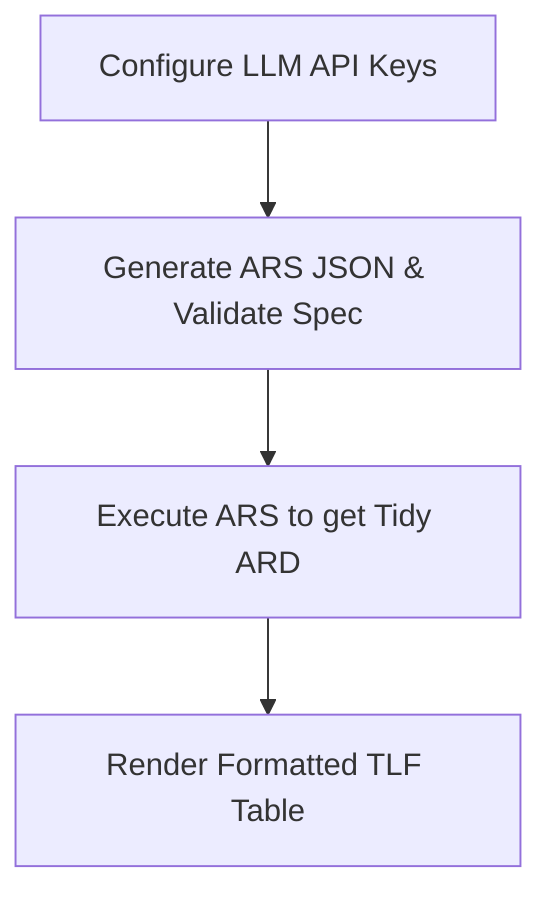

<!-- README.md is generated from README.Rmd. Please edit that file -->

# arsbridge

<!-- badges: start -->

[](https://lifecycle.r-lib.org/articles/stages.html#experimental)
[](https://github.com/tavakohr/arsbridge/actions/workflows/R-CMD-check.yaml)
[](https://opensource.org/licenses/MIT)
<!-- badges: end -->

`{arsbridge}` is the only R package that takes an annotated Word TLF
shell all the way to a publication-ready formatted clinical table – no
manual formatting step required. It natively parses, validates, and
executes CDISC **Analysis Results Standard (ARS)** specifications into
tidy **Analysis Results Data (ARD)** objects using `{cards}`, then
renders them to formatted GT tables via `{tfrmt}`.

The package is built for real clinical workflows: it extracts
authoritative variable-to-row mappings directly from annotated TLF
shells, cross-references them against your study’s ADaM specification
(`define.xml` or Excel), enriches the metadata using LLM assistance
(Anthropic Claude, OpenAI, or Gemini), and natively runs the
calculations against ADaM datasets.

------------------------------------------------------------------------

## Key Features

1.  **Multi-Provider LLM Integration**: Natively configure and use
    Anthropic, OpenAI, or Gemini API keys to automate metadata
    enrichment.
2.  **Authoritative Parsing**: Extract annotations without guessing. It
    relies on the lead programmer’s annotations in the Word shells as
    the ground truth.
3.  **Spec Validation**: Checks every annotation against your ADaM spec
    (`define.xml` or Excel) and produces an interactive Excel validation
    report showing gaps or typos.
4.  **Native ARD Execution**: Runs the generated ARS JSON directly using
    `{cards}` against `.xpt` or `.csv` datasets, recursively applying
    population (`analysisSets`) and data subsetting (`dataSubsets`)
    filters.
5.  **Publication-Ready Tables**: Renders any ARS output to a formatted
    GT table via `{tfrmt}` with `ars_render_tlf()` – auto-detecting
    treatment columns, row groups, and labels; rescaling percentages;
    and carrying titles and footnotes through. Closes the loop from
    annotated shell to final TLF.

------------------------------------------------------------------------

## Installation

You can install `{arsbridge}` from GitHub:

``` r
# install.packages("devtools")
devtools::install_github("tavakohr/arsbridge")
```

------------------------------------------------------------------------

## Step-by-Step Workflow & Function Guide

Here is the step-by-step use of the functions in `{arsbridge}`:



### Step 1: Set Up and Check API Keys

`{arsbridge}` supports multiple LLM providers. You can store your API
keys in your user `.Renviron` file so they load automatically in future
sessions.

``` r
library(arsbridge)

# Set up your preferred API key
# (Interactive prompts hide input when the 'askpass' package is installed)
set_anthropic_key()  # Writes ANTHROPIC_API_KEY to ~/.Renviron
set_openai_key()     # Writes OPENAI_API_KEY to ~/.Renviron
set_gemini_key()     # Writes GEMINI_API_KEY to ~/.Renviron

# Show what API keys are configured and which provider is currently active
show_active_llm()
```

#### How Provider Selection Works:

By default, if multiple API keys are set, `{arsbridge}` searches in the
priority order: **Anthropic** $\rightarrow$ **OpenAI** $\rightarrow$
**Gemini**. To override this default order and choose a specific active
provider, set the `ARS_LLM_PROVIDER` environment variable (e.g., in your
`.Renviron` or `.env` file):

``` env
ARS_LLM_PROVIDER=openai
```

Or configure it in R using global options:

``` r
options(ars.llm.provider = "gemini")
```

------------------------------------------------------------------------

### Step 2: Generating ARS JSON from Annotated Shells

The primary orchestration function is `spec_to_ars()`. It extracts
annotations from a Word TLF shell, cross-references them against an ADaM
spec, calls the active LLM once per TLF section for semantic enrichment,
and writes the CDISC ARS JSON.

``` r
res <- spec_to_ars(
  shell_path     = "inputs/APX-DRM-301_TLF_Shells_v1.0_sample_annotated.docx",
  adam_spec_path = "inputs/adam_spec_APX-DRM-301.xlsx", # Can also be define.xml
  output_path    = "outputs/reporting_event.json",
  report_path    = "outputs/spec_validation_report.xlsx",
  study_id       = "APX-DRM-301",
  study_name     = "PROSVALIN Phase 3 Study",
  verbose        = TRUE
)
```

#### Understanding the Arguments:

- `shell_path`: Path to the annotated Microsoft Word `.docx` file.
- `adam_spec_path`: Grounding specification. Accepts either `.xml` (ADaM
  `define.xml`, preferred) or `.xlsx` / `.xls` (ADaM spec Excel sheet).
- `output_path`: Path where the structured CDISC ARS JSON draft will be
  saved.
- `report_path`: Path for the generated Excel validation sheet showing
  errors.

------------------------------------------------------------------------

### Step 3: Inspecting Spec Validation Results

The validation report (`outputs/spec_validation_report.xlsx`) is an
Excel workbook that cross-references all shell annotations with the ADaM
spec, assigning a status of **PASS**, **WARN**, or **FAIL**. This allows
programmers to catch typos and identify missing variables in the ADaM
spec prior to writing R code.

``` r
# Retrieve validation summary programmatically
table(res$validation$status)
```

------------------------------------------------------------------------

### Step 4: Native Execution to Tidy ARD using `{cards}`

Once the ARS JSON has been generated, you can execute it natively using
`ars_to_ard()`. It dynamically loads the necessary ADaM datasets and
runs calculations using the `{cards}` package.

``` r
ard <- ars_to_ard(
  ars_path = "outputs/reporting_event.json",
  adam_dir = "inputs/ADaM"
)

# Inspect the resulting tidy ARD
print(ard)
```

#### Selective Execution:

To run only a specific subset of outputs or analyses (e.g. for debugging
or incremental builds), pass character vectors to `output_ids` or
`analysis_ids`:

``` r
# Run only the demographics table output
ard_demog <- ars_to_ard(
  ars_path   = "outputs/reporting_event.json",
  adam_dir   = "inputs/ADaM",
  output_ids = "T_DEMOG"
)

# Run only a specific analysis ID
ard_age_only <- ars_to_ard(
  ars_path     = "outputs/reporting_event.json",
  adam_dir     = "inputs/ADaM",
  analysis_ids = "AN_DEMOG_AGE"
)
```

------------------------------------------------------------------------

## Configuring ARS Outputs & ADaM Data Filters

### 1. Shell Annotation Format

For `{arsbridge}` to extract annotations, the lead programmer inserts
annotations into the Word document shell.

- **Primary variable assignment**: Enclose variables in square brackets,
  prefixed by the dataset name (e.g., `[ADSL.AGE]`, `[ADAE.AEDECOD]`).
- **Data Subsets**: Specify where-conditions inside the square brackets
  (e.g., `[ADAE.AEDECOD WHERE AEREL == "RELATED"]`).
- **Population filter**: Flags like `[SAFFL == "Y"]` in the column
  headers determine the active population (`analysisSets`).

### 2. Dataset Auto-Loading

When `ars_to_ard()` executes: 1. It scans the `adam_dir` for files named
`<DATASET_NAME>.xpt` (read using `{haven}`) or `<DATASET_NAME>.csv`
(read using `read.csv`). 2. It caches the loaded datasets in memory to
ensure fast subsequent execution.

### 3. Subsetting & Filtering Logic

- **Analysis Sets (Populations)**: Evaluated at the subject level (via
  `USUBJID`). The active subset of subjects is intersected with the
  primary analysis dataset.
- **Data Subsets (Data Filters)**: Evaluated within the primary analysis
  dataset itself (e.g., filtering `ADAE` for treatment-emergent adverse
  events where `TRTEMFL == "Y"`).
- **Compound Expressions**: `{arsbridge}` supports recursive parsing of
  nested expressions containing logical operators (`AND` and `OR`).

### 4. Calculation Mapping to `{cards}`

`ars_to_ard()` maps standard ARS method identifiers to `{cards}`
function calls: - `MTH_SUMMARY_STATISTICS_CONTINUOUS` $\rightarrow$
`cards::ard_continuous()` - `MTH_COUNT_AND_PERCENTAGE` $\rightarrow$
`cards::ard_categorical()` - `MTH_AE_FREQUENCY_COUNT` $\rightarrow$
Evaluates distinct subject counts (`dplyr::distinct(USUBJID, variable)`)
before calling `cards::ard_categorical()`. - `MTH_SUBJECT_COUNT`
$\rightarrow$ `cards::ard_total_n()` or `cards::ard_categorical()`.

Each computed row is injected with traceability metadata: `analysis_id`,
`method_id`, and `output_id`.

------------------------------------------------------------------------

### Step 4: Rendering a Formatted TLF Table

With the ARD in hand, `ars_render_tlf()` formats any ARS output into a
publication-ready GT table – the final step of the closed-loop pipeline.

``` r
# Render the Subject Disposition table straight to a GT table
gt_table <- ars_render_tlf(
  ars_path  = "outputs/reporting_event.json",
  ard       = ard,
  output_id = "T_14_1_1"
)
gt_table
```

It auto-detects the treatment column, row groups, and row labels from
the ARD; rescales `{cards}` proportions to percentages; lays continuous
summaries out as `Mean (SD)` / `Median` / `(Min, Max)` rows; and carries
ARS titles and footnotes through to the GT output.

- `ars_to_tfrmt()` returns the underlying `{tfrmt}` spec if you want to
  customise it before printing.
- `ars_to_tfrmt_list()` returns one spec per output in a named list.

``` r
specs <- ars_to_tfrmt_list("outputs/reporting_event.json", ard)
all_tables <- lapply(names(specs), function(oid)
  ars_render_tlf("outputs/reporting_event.json", ard, oid))
```

------------------------------------------------------------------------

## Demonstration with Bundled Training Example

You can run the full end-to-end pipeline using the bundled `APX-DRM-301`
dataset without needing any external files:

``` r
library(arsbridge)

# 1. Inspect bundled files
arsbridge_example()

# 2. Run the conversion pipeline
res <- spec_to_ars_example()

# 3. Extract the unzipped ADaM directory
adam_dir <- file.path(tempdir(), "ADaM")
unzip(arsbridge_example("ADaM.zip"), exdir = adam_dir)

# 4. Execute the resulting ARS JSON into a tidy ARD
ard <- ars_to_ard(
  ars_path = res$ars_path,
  adam_dir = adam_dir
)

# 5. Look at the dimensions of the final ARD object
dim(ard)

# 6. Render a formatted clinical table (Subject Disposition)
ars_render_tlf(res$ars_path, ard, "T_14_1_1")
```

------------------------------------------------------------------------

## License

MIT © Hamid Tavakoli. See [LICENSE.md](LICENSE.md).
