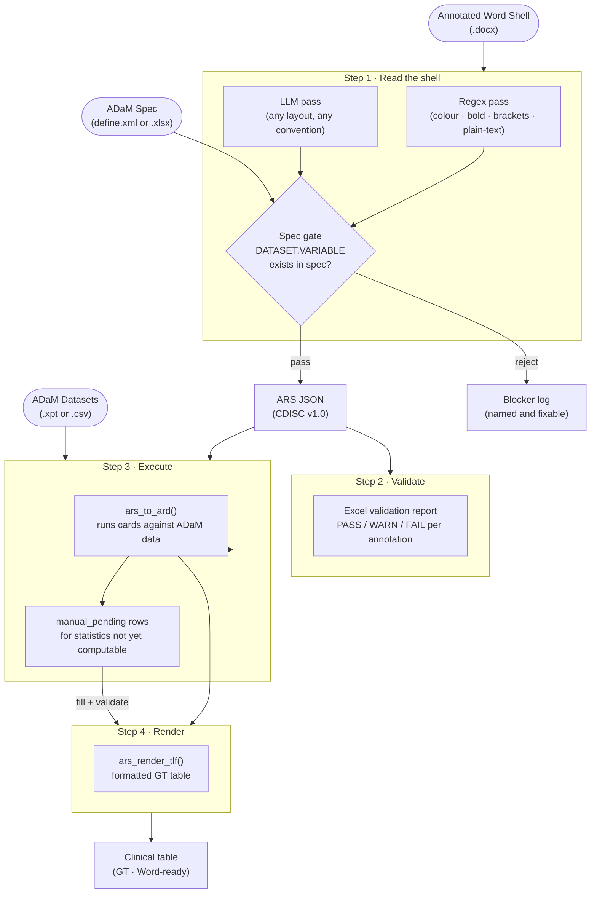

<!-- README.md is generated from README.Rmd. Please edit that file -->

# arsbridge

<!-- badges: start -->

[](https://lifecycle.r-lib.org/articles/stages.html#experimental)
[](https://github.com/tavakohr/arsbridge/actions/workflows/R-CMD-check.yaml)
[](https://app.codecov.io/gh/tavakohr/arsbridge)
[](https://opensource.org/licenses/MIT)
<!-- badges: end -->

> **From annotated Word shell to publication-ready clinical table, in one reproducible pipeline.**

Clinical programmers spend hours translating a lead programmer's annotated TLF shell into R code, then reformatting output to match the shell layout. `{arsbridge}` automates both halves. It reads the annotations directly from the Word document, checks every variable against your ADaM spec, generates a CDISC Analysis Results Standard (ARS) JSON, executes it against real ADaM datasets with `{cards}`, and renders a formatted GT table ready to ship.

No manual transcription. No orphan numbers. Every value auditable back to its source.

------------------------------------------------------------------------

## What you get

| Capability | What it means for you |
|---|---|
| **Dual-pass shell reading** | A regex detector handles known annotation conventions; an LLM handles everything else. You get more extracted rows with fewer assumptions. |
| **Spec-gated validation** | Every variable the LLM proposes is checked against your ADaM spec. A variable missing from the spec is rejected and logged, never silently invented. |
| **CDISC ARS JSON output** | The extraction result is a structured, versioned file you can diff, review, and feed to downstream tools like `{siera}`. |
| **Native ARD execution** | Run ARS JSON directly against `.xpt` or `.csv` datasets using `{cards}`, with no dataset-loading boilerplate. |
| **Publication-ready tables** | `ars_render_tlf()` builds a formatted GT table: treatment columns detected, percentages rescaled, row groups labelled, ARS footnotes carried through. |
| **Partial tables, full traceability** | Statistics arsbridge cannot yet compute are reserved as keyed `manual_pending` rows. Each shows a `[‡ manual]` marker in the table until a programmer fills it with a validated script. Nothing is ever an orphan number. |

------------------------------------------------------------------------

## The pipeline at a glance



------------------------------------------------------------------------

## Installation

You can install `{arsbridge}` from GitHub:

``` r
# install.packages("devtools")
devtools::install_github("tavakohr/arsbridge")
```

For exact Clopper-Pearson confidence intervals, also install the
optional `{cardx}`. Without it, those cells degrade gracefully to
`manual_pending` placeholders rather than erroring.

``` r
install.packages("cardx")
```

------------------------------------------------------------------------

## Quick start with the bundled example

You do not need any external files to run the full pipeline. The package
ships with a complete clinical study example (40 TLF shells, simulated
ADaM data) so you can see the whole thing before touching your own
study.

``` r
library(arsbridge)

# 1. Run the full extraction pipeline on the bundled study
res <- spec_to_ars_example()
#    Takes about 6 minutes (40 LLM calls)
#    res$n_tlfs      # 40
#    res$n_analyses  # ~226

# 2. Review the validation findings
table(res$validation$status)

# 3. Load the bundled simulated ADaM data
adam_dir <- file.path(tempdir(), "ADaM")
unzip(arsbridge_example("ADaM.zip"), exdir = adam_dir)

# 4. Execute the ARS JSON into a tidy ARD
ard <- ars_to_ard(ars_path = res$ars_path, adam_dir = adam_dir)

# 5. Render the Subject Disposition table
ars_render_tlf(res$ars_path, ard, "T_14_1_1")
```

------------------------------------------------------------------------

## Step-by-step with your own study

### Step 1: Set up LLM access

`{arsbridge}` works with Anthropic, OpenAI, Gemini, or any
OpenAI-compatible provider. Store keys in `~/.Renviron` so they persist
across sessions.

``` r
library(arsbridge)

set_anthropic_key()   # recommended for clinical text (lowest content-filter false-positive rate)
set_openai_key()      # alternative
set_gemini_key()      # alternative

show_active_llm()     # confirm which provider is active
```

**Provider priority:** when multiple keys are configured, `{arsbridge}`
searches in order: Anthropic, OpenAI, Gemini. Override this anytime:

``` env
# In .Renviron
ARS_LLM_PROVIDER=openai
```

``` r
# Or at runtime
options(ars.llm.provider = "gemini")
```

**Switching to a newer model or a different provider** requires almost
no effort. To use a newer model from the same provider, pass `model =`:

``` r
spec_to_ars(..., model = "claude-opus-4-8")
```

To add a brand-new provider (GLM, DeepSeek, OpenRouter), add one entry
to the registry in `R/llm_providers.R`: its key env variable, default
model, the `ellmer` chat constructor, and a `base_url` if it is
OpenAI-compatible. No other code changes.

``` r
set_llm_key("glm", "your-glm-key")
Sys.setenv(ARS_LLM_PROVIDER = "glm")
spec_to_ars(..., model = "glm-4.6")
```

------------------------------------------------------------------------

### Step 2: Extract ARS JSON from the annotated shell

`spec_to_ars()` is the main entry point. Point it at your annotated
Word shell and ADaM spec; it writes a CDISC ARS JSON and an Excel
validation report.

``` r
res <- spec_to_ars(
  shell_path     = "inputs/APX-DRM-301_TLF_Shells_v1.0_sample_annotated.docx",
  adam_spec_path = "inputs/adam_spec_APX-DRM-301.xlsx",   # or define.xml
  output_path    = "outputs/reporting_event.json",
  report_path    = "outputs/spec_validation_report.xlsx",
  study_id       = "APX-DRM-301",
  study_name     = "PROSVALIN Phase 3 Study",
  verbose        = TRUE
)
```

| Argument | What to pass |
|---|---|
| `shell_path` | The annotated `.docx` file from the lead programmer |
| `adam_spec_path` | `define.xml` (preferred) or an ADaM spec `.xlsx` / `.xls` |
| `output_path` | Where to save the CDISC ARS JSON |
| `report_path` | Where to save the Excel validation workbook |

------------------------------------------------------------------------

### Step 3: Review the validation report

The Excel report cross-references every shell annotation against the
ADaM spec and stamps each one **PASS**, **WARN**, or **FAIL**. This is
your opportunity to catch typos and missing ADaM variables before any
analysis code runs.

``` r
# Counts by status
table(res$validation$status)

# Filter to problems only
subset(res$validation, status %in% c("WARN", "FAIL"))
```

------------------------------------------------------------------------

### Step 4: Execute to a tidy ARD

`ars_to_ard()` runs the ARS JSON against your ADaM datasets and returns
a tidy ARD in `{cards}` format. It auto-loads datasets, applies
population and data subset filters recursively, and calls the right
`{cards}` function for each method.

``` r
ard <- ars_to_ard(
  ars_path = "outputs/reporting_event.json",
  adam_dir = "inputs/ADaM"
)

print(ard)
```

During development, narrow the run to specific outputs or analyses for
faster iteration:

``` r
# Only the demographics table
ard_demog <- ars_to_ard(
  ars_path   = "outputs/reporting_event.json",
  adam_dir   = "inputs/ADaM",
  output_ids = "T_DEMOG"
)

# Only one analysis within that table
ard_age <- ars_to_ard(
  ars_path     = "outputs/reporting_event.json",
  adam_dir     = "inputs/ADaM",
  analysis_ids = "AN_DEMOG_AGE"
)
```

------------------------------------------------------------------------

### Step 5: Render the formatted table

``` r
gt_table <- ars_render_tlf(
  ars_path  = "outputs/reporting_event.json",
  ard       = ard,
  output_id = "T_14_1_1"
)
gt_table
```

`ars_render_tlf()` handles all the formatting automatically: treatment
columns and row groups are detected from the ARD, `{cards}` proportions
are rescaled to display percentages, continuous summaries are laid out
as `Mean (SD)` / `Median` / `(Min, Max)` rows, and ARS titles and
footnotes are attached as GT source notes.

To inspect or customise the underlying `{tfrmt}` spec before rendering:

``` r
# Inspect the tfrmt spec for one output
spec <- ars_to_tfrmt("outputs/reporting_event.json", ard, "T_14_1_1")

# Render all outputs in one pass
specs <- ars_to_tfrmt_list("outputs/reporting_event.json", ard)
all_tables <- lapply(names(specs), function(oid)
  ars_render_tlf("outputs/reporting_event.json", ard, oid))
```

------------------------------------------------------------------------

### Step 6: Fill any reserved cells

Some statistics fall outside what arsbridge can compute today. These are
not dropped or replaced with zeros. Instead, each one becomes a keyed
`manual_pending` row in the ARD with a `[‡ manual]` marker in the
rendered table, so every programmer knows exactly what still needs a
derivation.

``` r
# See what is waiting
ars_manual_worklist(ard)

# Compute the value in a validated script, then write it back
i <- which(ard$result_status == "manual_pending")[1]
ard$stat[[i]]         <- 0.012
ard$result_status[i]  <- "manual_filled"
ard$value_source[i]   <- "manual"
ard$derivation_ref[i] <- "programs/cmh_t1421.R"   # the program that produced it

# Confirm every manual fill is traceable before rendering
ars_validate_manual_fills(ard)
```

`ars_render_all()` runs this check automatically and blocks any
untraceable value before it reaches the final document.

------------------------------------------------------------------------

## How arsbridge reads the shell

Every clinical study annotates its TLF shells differently. The ADaM
variable for a row might appear as a red-coloured run, a bold fragment,
a bracketed condition like `[ADAE.AEDECOD WHERE AEREL='RELATED']`, plain
text after the label, or a layout that no regex was ever written for. A
single detection strategy cannot cover all of these reliably.

arsbridge reads each shell **twice and takes the union.**

```
           annotated shell (.docx)
                    |
      +-------------+-------------+
      |                           |
      v                           v
1. REGEX PASS               2. LLM PASS
   parse_shell_docx()          extract_shell_llm()
   four-layer detector          re-reads raw cell text,
   - colour                     separates display label
   - bold/italic/underline      from variable reference
   - plain-text DATASET.VAR     in any layout
   - bracket [DATASET.VAR]
      |                           |
      +-------------+-------------+
                    |
                    v
          3. HARD SPEC GATE
     every DATASET.VARIABLE must
     exist in the ADaM spec, or it is
     rejected and logged as a blocker
                    |
                    v
       validated annotations -> ARS JSON
```

**Pass 1: deterministic regex** (`parse_shell_docx()`) walks the
document OOXML and runs a four-layer detector on every stub cell and
listing header. It handles known conventions with no API call. This pass
always runs, even with no API key.

**Pass 2: LLM as primary reader** (`extract_shell_llm()`) re-reads the
raw text of each cell and separates the human display label from the
machine variable reference, in whatever layout the shell uses. This is
where the "any convention" power comes from: the LLM generalises to
formats the regex was never designed for. It returns structured output
via an `ellmer` type, never free text to parse.

**Pass 3: spec gate** checks every proposed `DATASET.VARIABLE` against
your ADaM spec. A proposal not in the spec is dropped, not shipped, and
recorded as a blocking finding that names the row and the rejected token.
The spec is the ground-truth oracle.

| Situation | Regex | LLM | Result |
|---|:---:|:---:|---|
| Known annotation convention | ✓ | silent | Regex result kept |
| Known convention, same read | ✓ | ✓ same | Confirmed |
| Known convention, different reads | ✓ | ✓ different | **LLM wins** + `WARN` |
| Variant layout regex cannot parse | ✗ | ✓ | **LLM adds the row** |
| LLM proposes a variable not in spec | ✗ | rejected | Dropped + **blocker logged** |
| Row has no variable | ✗ | silent | Empty |

With no API key, or with `extract_with_llm = FALSE`, the LLM pass is
skipped and arsbridge runs on the regex alone. Standard shells still
produce valid ARS, ARD, and rendered output.

See `vignette("reading-engine")` for the complete parsing detail.

------------------------------------------------------------------------

## Statistical coverage

arsbridge handles descriptive statistics natively and an expanding set
of inferential statistics automatically. For anything it cannot yet
compute, it reserves a traceable placeholder rather than refusing the
whole table.

| Statistic | Status | Engine |
|---|---|---|
| Summary statistics (mean, SD, median, min, max) | Computed | `cards::ard_continuous()` |
| Counts and percentages | Computed | `cards::ard_categorical()` |
| AE frequencies (distinct subjects per event) | Computed | dedup then `cards::ard_categorical()` |
| Subject counts (N) | Computed | `cards::ard_total_n()` |
| Exact Clopper-Pearson CI | Computed (requires `{cardx}`) | `cardx::ard_categorical_ci()` |
| Cochran-Mantel-Haenszel p-value | Computed | Base R `mantelhaen.test()` |
| Newcombe difference interval | Reserved: `[‡ manual]` | Manual fill round-trip |
| Odds ratio / hazard ratio | Reserved: `[‡ manual]` | Manual fill round-trip |
| ANCOVA / MMRM | Reserved: `[‡ manual]` | Manual fill round-trip |
| NRI imputation | Reserved: `[‡ manual]` | Manual fill round-trip |

Reserved cells are never blank or coerced to a misleading zero. Each
carries a unique key (`analysis_id`, `method_id`, `output_id`) and
renders as a visible marker until a programmer supplies the value from a
validated script.

------------------------------------------------------------------------

## Annotation format reference

The lead programmer marks up the Word shell before handing it off. The
most common conventions:

| What to annotate | Format | Example |
|---|---|---|
| Row variable | `[DATASET.VARIABLE]` | `[ADSL.AGE]` |
| Row with filter | `[DATASET.VARIABLE WHERE condition]` | `[ADAE.AEDECOD WHERE AEREL='RELATED']` |
| Population flag (column header) | `[FLAG == "Y"]` | `[SAFFL == "Y"]` |
| Colour-marked variable | Red `#C00000` run | `ADSL.AGE` in red text |
| Listing column header | Label on line 1, variable on line 2 | `Subject ID` / `USUBJID` |

The regex pass handles colour, bold/italic/underline, bracket, and
plain-text patterns. The LLM pass handles everything else, including
mixed or non-standard layouts.

------------------------------------------------------------------------

## Dataset loading and filtering

When `ars_to_ard()` runs, it:

1.  Scans `adam_dir` for `<DATASET>.xpt` files (loaded via `{haven}`) or `<DATASET>.csv` files.
2.  Caches each dataset in memory so repeated analyses run fast.
3.  Applies analysis set (population) filters at the subject level via `USUBJID`, intersecting the population with the analysis dataset.
4.  Applies data subset filters within the analysis dataset, supporting recursive `AND` / `OR` compound expressions.

The ARS method identifier in each analysis maps to a specific `{cards}` function:

| Method ID | Function called |
|---|---|
| `MTH_SUMMARY_STATISTICS_CONTINUOUS` | `cards::ard_continuous()` |
| `MTH_COUNT_AND_PERCENTAGE` | `cards::ard_categorical()` |
| `MTH_AE_FREQUENCY_COUNT` | Distinct-subject dedup, then `cards::ard_categorical()` |
| `MTH_SUBJECT_COUNT` | `cards::ard_total_n()` or `cards::ard_categorical()` |
| `MTH_PROPORTION_CI_EXACT` | `arsbridge::ard_proportion_ci_exact()` |
| `MTH_CMH_TEST` | `arsbridge::ard_cmh_test()` |

Every row in the ARD carries provenance columns: `analysis_id`,
`method_id`, `output_id`, `result_status` (`computed`,
`manual_pending`, or `manual_filled`), `value_source`, and
`derivation_ref`. Computed and manual values are distinguishable and
auditable side by side.

------------------------------------------------------------------------

## License

MIT © Hamid Tavakoli. See [LICENSE.md](LICENSE.md).
